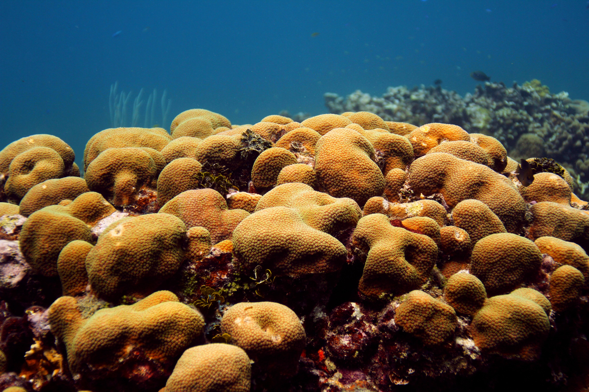
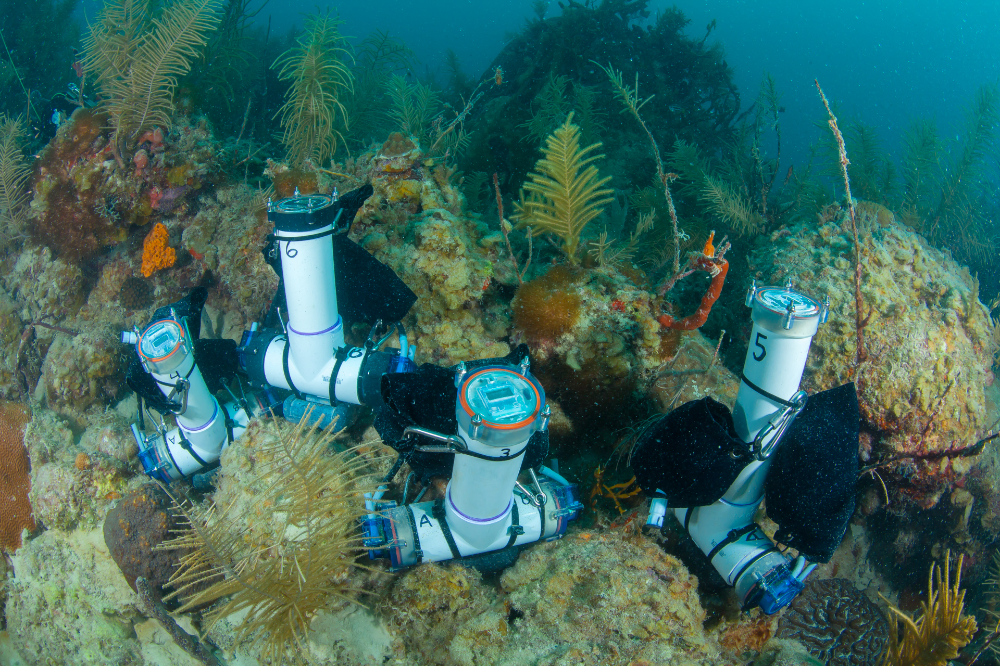
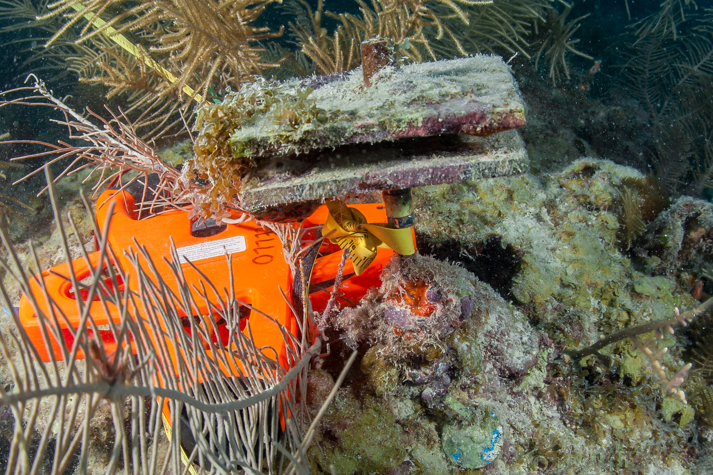
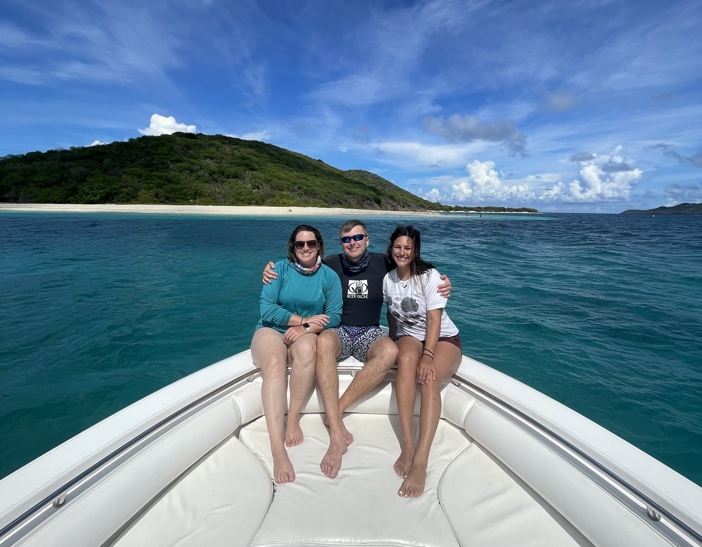

---
output:
  html_document:
    fig_height: 5
    fig_width: 5
    fig_position: center
  always_allow_html: true
  word_document: default
editor_options: 
  chunk_output_type: console
---

<h1 style="color: darkblue;font size=24, align=center" > National Coral Reef Monitoring Program</h1> 

<h2 style="color: darkblue;font size=12"> Climate Monitoring Brief: Puerto Rico</h2>
--------


```{r setup, include=FALSE}
knitr::opts_chunk$set(echo = FALSE,
                message = FALSE, warning = FALSE, 
                fig.align = "center")
options(htmltools.dir.version = FALSE)
```

 
```{r libraries, include=FALSE}
library(dplyr)
library(reshape)
library(tidyverse)
library(lubridate)
library(stringr)
library(fs)

library(plotly)
library(scales)
library(ggpubr)
library(RColorBrewer)
library(scales)
library(openair)
library(magick)
library(ggplot2)
library(cowplot)

library(knitr)

# Map
library(leaflet)

# Dynamic html to static
#install.packages("webshot")
library(webshot)
#webshot::install_phantomjs()
#library(PhantomJS)
```


```{r front, echo=FALSE, out.width = '75%', fig.cap="Orbicella faveolata in St. Croix, USVI", fig.align='center'}



```

<br>

<h4 style="font size=8">
Atlantic Oceanographic &amp; Meteorological Laboratory Coral Program<br>
University of Miami Cooperative Institute of Marine and Atmospheric Science<br>
National Oceanic Atmospheric Administration</h4>

<br>

<h5 style="font size=6">
N. Besemer, A. Palacio, A. Webb, G. Kolodziej, T.Gill, I. Enochs - XX 2023
</h5>

```{r logos, echo=FALSE, fig.align='left', out.width='20%'}
p1 <- ggdraw() + draw_image("Logos/AOML.jpg", scale = 1)
p2 <- ggdraw() + draw_image("Logos/CIMAS.png", scale = 0.9)

plot_grid(p1, p2)
```

 
--------

### About this summary brief

The NOAA Atlantic Oceanographic and Meteorological Laboratory (AOML) conducts the long-term National Coral Reef Monitoring Program (NCRMP) to track the status and trends of coral reef ecosystems of the U.S. Atlantic and Caribbean coral reef jurisdictions. This summary brief provides an overview of the most recent survey efforts to Puerto Rico.


### Expedition summary

* The NCRMP Atlantic climate monitoring team recently traveled to Puerto Rico from May 17fh to September 25th, 2023
* 16 different sites were visited by four team members and collaborators completing a total of 51 dives. 
* These sites represent temporal‐resolution monitoring with moored instruments at fixed time‐series which are placed on depth gradient to assess how vertical structure affects reef status and trends.

--------

### Data collection

```{r get Temp, include=FALSE}
# 1. Import all processed temperature data
read_plus <- function(flnm) {
  read_csv(flnm ) %>%
    mutate(filename = flnm)
}

tbl_with_sources <-
    list.files(pattern = "*.csv", 
               full.names = T) %>% 
    map_df(~read_plus(.))

STR_all <-
    list.files(path = "Data/STRs",
               pattern = "*.csv", 
               full.names = T, 
               recursive = TRUE) %>% 
    map_df(~read_plus(.)) 


STR_all <- STR_all %>%
      mutate_at("filename", str_replace, "Data/STRs/PR_", "")

colmn<-c("Transect", "Depth", "SN", "Tag", "Location")
STR_all <-
  tidyr::separate(
    data = STR_all,
    col = filename,
    sep = "_",
    into = colmn,
    remove = TRUE
  )

STR_all$Transect[STR_all$Transect=="east"]<-"East"
STR_all$Transect[STR_all$Transect=="west"]<-"West"
STR_all$Transect[STR_all$Transect=="north"]<-"North"
STR_all$Transect[STR_all$Transect=="south"]<-"South"
#STR_all_2$Site<-paste(STR_all$Transect, STR_all$Site, sep="_")

## Formatting

STR_all$Depth[STR_all$Depth=="01m"]<-"1m"
STR_all$Depth[STR_all$Depth=="02m"]<-"1m"
STR_all$Depth[STR_all$Depth=="05m"]<-"5m"
STR_all$Depth[STR_all$Depth=="06m"]<-"5m"
STR_all$Depth[STR_all$Depth=="07m"]<-"5m"
STR_all$Depth[STR_all$Depth=="08m"]<-"5m"
STR_all$Depth[STR_all$Depth=="20m"]<-"15m"
STR_all$Depth[STR_all$Depth=="19m"]<-"15m"
STR_all$Depth[STR_all$Depth=="25m"]<-"25m"
STR_all$Depth[STR_all$Depth=="26m"]<-"25m"
STR_all$Depth[STR_all$Depth=="30m"]<-"25m"
STR_all$Depth[STR_all$Depth=="31m"]<-"25m"

STR_all$Depth<-factor(STR_all$Depth, 
                levels = c("1m", "5m", "15m","25m"))
summary(STR_all$Depth)

STR_all$Transect<-factor(STR_all$Transect, 
                levels = c("North", "East",
                           "South","West"))
summary(STR_all$Transect)
```

* Subsurface **temperature** recorders (STRs) were recovered and redeployed at all 6 transects, each one composed by 4 depths (Fig. 1). Overall,  more than 4 million temperature observations were collected:
  
```{r Temp observations}
Cases_Loc_depth<-STR_all %>% count(Depth, Location,
                                  sort = FALSE)
Cases_Loc_depth<-as.data.frame(Cases_Loc_depth %>%
                   pivot_wider(names_from = Depth,
                   values_from = n))
Cases_Loc_depth$Total<-rowSums(Cases_Loc_depth[, c(2:5)], na.rm=TRUE)
#write.csv(Cases_Loc_depth, "FLK_results/0_SampleS_Region_zone.csv")

kable(Cases_Loc_depth,
      format.args = list(big.mark = ","),
      caption = "Table 1: Number of temperature observations collected by transect and depth")
```


```{r pH_and_temp_data, include=FALSE}

# 1.Get the pH data
# pH <- read.csv('Data/seafet-sn2114-pr-temporal-suite.csv')
# summary(pH)
# head(pH)

pH <- read_csv('Data/seafet-sn2114-pr-temporal-suite.csv',col_types = cols()) %>%
    select(DateTime = `DateTime (UTC+00:00)`,
           pH = `Internal pH (pH)`,
           Temperature = `pH Temperature (Celsius)`) %>%
    mutate(DateTime = parse_date_time(DateTime, '%m/%d/%y %H:%M')) %>%
    #manual start/stop time of monitoring
    filter(DateTime >= as.POSIXct('2023-05-21 12:15:00', tz='UTC') &
         DateTime <= as.POSIXct('2023-05-23 16:00:00', tz='UTC')) %>%
    mutate(DateTime = with_tz(DateTime, 'America/Puerto_Rico'))

```


```{r Current_data, include=FALSE}
# 2. Get current data
fileAny <- "Data/tilt-sn2102061-puerto-rico-suite.csv"
  # Are there going to be more than one current file? 
  current <- read.csv(fileAny, header = TRUE)
  summary(current)
  head(current)

# hardcoded limits for this DRTO file are
# ymd_hms("2021/06/25 18:30:00") and ymd_hms("2021/06/28 19:45:00")
# (future enhancement: incorporate Hannah Barkley's dataset trimming code; also, eliminate all the hardcoding below and calculate from data)

  # current$date = ymd_hms(paste0(current$Date, current$Time), tz = "UTC")
  current$date = ymd_hms(current$Timestamp.UTC, tz = "UTC")
  current <- current[, c("date","Speed..cm.s.","Heading..degrees.")]
  colnames(current) <- c("date","ws","wd")
  #manual start/stop time of monitoring
  current$DateTime<-NA
  current <- subset(current, date >= ymd_hms("2023-05-21 12:00:00") &
                     date <= ymd_hms("2023-05-23 16:00:00"))
  current$DateTime <- lubridate::with_tz(current$date,
                                         "America/Puerto_Rico")
  
  summary(current$DateTime )

```

```{r PAR_data, include = FALSE}
# 3. Get the PAR data  

  light <- read_csv('Data/ecopar-sn6521-pr-temporal-suite.csv',
                    col_types = cols()) %>%
          #mutate(DateTime = parse_date_time(DateTime, '%m/%d/%Y %H:%M:%S')) %>%
          mutate(DateTime = mdy_hms(`Datetime (AST)`, tz="America/Puerto_Rico")) %>%
          select(DateTime, `PAR (calc)`) %>%
          drop_na() %>%
          mutate(interval = 0:(nrow(.)-1) %/% 10) %>%
          group_by(interval) %>%
          summarise(DateTime = mean(DateTime),
                    PAR = mean(`PAR (calc)`),
                    sd = sd(`PAR (calc)`)) %>%
        select(-interval) %>%
  #manual start/stop time of monitoring
   filter(DateTime >= as.POSIXct('2023-05-21 08:00:00', tz='America/Puerto_Rico') &
          DateTime <= as.POSIXct('2023-05-23 12:30:00', tz='America/Puerto_Rico'))

summary(light$DateTime)

```

```{r}
pH_count<-paste0("pH = ", nrow(pH), " observatons")
pH_count
current_count<-paste0("Current = ", nrow(current), " observatons")
current_count
light_count<-paste0("Light = ", nrow(light), " observatons")
light_count
```

**NCRMP Climate fixed sentinel site monitoring
At La Prguera, 5m site, located in SW Puerto Rico short term instruments (54h) were deployed to  monitor daily fluctuations in: 
  * **Current**: 209 observations
  * **pH**: 208 observations
  * **Light**: 208 observations
  * **Carbonate Chemistry**: 15 samples collected
  * **Carbonate budget surveys**: Benthic cover, sponge, urchin and parrotfish surveys completed at 6 transects

<br>

** Habitat persistence**
Changes in bioerosion and accretion were monitored:
  * **Carbonate budget surveys**: Benthic cover, sponge, urchin, and parrotfish surveys	completed at six transects
  * **Bioerosion**: 60 Bioerosion Monitoring Units (BMUs) collected, 60 redeployed 
  * **Calcification**: 30 Calcification Accretions Units (CAUs) collected, 30 redeployed
  * **Benthic cover**: 6 landscape mosaics


<br>

```{r mapInfo, include=FALSE, fig.align='center'}
# Map information
    # Add info from the sampling stations
    stations <- read.csv("Data/PR_Stations.csv", header = T)
    #head(stations)
    
    stations$Location<-as.character(stations$Location)
    stations$Depth<-paste(as.character(stations$binDepth),"m")
    
    #stations$Site<-factor(stations$Site, levels = c(""))
    stations$Depth<-ordered(stations$Depth, 
                            levels = c("1 m", "5 m", "15 m", "25 m"))
    
    stations$Size[stations$binDepth==1]<-5
    stations$Size[stations$binDepth==5]<-4
    stations$Size[stations$binDepth==15]<-3
    stations$Size[stations$binDepth==25]<-2
    
    #summary(stations)
    kable(head(stations[, -6], format = "html"))

# Change color depending on type of data?

  # Create palette 
  #brewer.pal(n = 9, name = "Blues")
  #library(RColorBrewer)
  #my_blues <- c(brewer.pal(9, "Blues")[c(4,5,6,7,8, 9)])
  
  # Assigne it to Depth and locations
  pal.gen <- colorFactor(palette = "Blues",
                         domain = stations$Depth)
  brewer.pal(n=8, "Blues")

  pal.gen2 <- colorFactor(palette = "Blues",
                         domain = stations$Depth)
# Noth arrow
  #North <- "Data/North-Arrow.png"
  
  # myicon <- makeIcon( iconUrl = "Data/North-Arrow.png", 
  #                   iconWidth=30,
  #                   iconHeight=30)

```

```{r makeAmap, echo=FALSE, fig.width = 9, fig.height = 3.5, fig.align='center'}
map<-leaflet(stations, width = '800px') %>% 
  addTiles() %>%
  addProviderTiles(providers$Esri.WorldGrayCanvas) %>%
  
  addLegend(position = "bottomright",
            pal = pal.gen2, 
            values = ~Depth, opacity = 1) %>%
  addScaleBar(position = "topright") %>%

  fitBounds(lng1=-67.35, lat=18.2, lng2=-65.2, lat2=18.1)%>%
  
  addCircleMarkers(lng = ~Lon, lat = ~Lat, 
                   stroke = F, 
                   radius = ~Size*2, 
                   fillOpacity = 1,
                   color = ~pal.gen(Depth),
                   label = ~Depth,
                   labelOptions = labelOptions(
                     noHide = F,
                     textOnly = TRUE,
                     style = list(
        "color" = "black"))) %>%

# Sub_regions
     addRectangles(
      lng1=-66.71783, lat1=18.53,
      lng2=-66.71783, lat2=18.53,
      opacity = 1,
      color = "gray",
      #color = "#F8766D",
      weight=2,
      fillColor = "transparent",
      label = "Arecibo",
      labelOptions = labelOptions(
                       noHide = T, direction = "top",
                       offset = c(0, 0),
                       textOnly = F)) %>%
    addRectangles(
          lng1=-66.23, lat1=17.85,
          lng2=-66.23, lat2=17.85,
          opacity = 1,
          color = "gray",
          #color = "#F8766D",
          weight=2,
          fillColor = "transparent",
          label = "Jobos Bay",
          labelOptions = labelOptions(
                           noHide = T, direction = "bottom",
                           offset = c(0, 0),
                           textOnly = F)) %>%
    addRectangles(
          lng1=-67.05067, lat1=17.85,
          lng2=-67.05067, lat2=17.85,
          opacity = 1,
          color = "gray",
          #color = "#F8766D",
          weight=2,
          fillColor = "transparent",
          label = "La Parguera",
          labelOptions = labelOptions(
                           noHide = T, direction = "bottom",
                           offset = c(0, 0),
                           textOnly = F))%>%
    addRectangles(
          lng1=-67.27, lat1=18.28,
          lng2=-67.27, lat2=18.28,
          opacity = 1,
          color = "gray",
          #color = "#F8766D",
          weight=2,
          fillColor = "transparent",
          label = "Ricon",
          labelOptions = labelOptions(
                           noHide = T, direction = "bottom",
                           offset = c(0, 0),
                           textOnly = F))%>%
    addRectangles(
          lng1=-65.32, lat1=18.28,
          lng2=-65.32, lat2=18.28,
          opacity = 1,
          color = "gray",
          #color = "#F8766D",
          weight=2,
          fillColor = "transparent",
          label = "Culebra",
          labelOptions = labelOptions(
                           noHide = T, direction = "bottom",
                           offset = c(0, 0),
                           textOnly = F))%>%
    addRectangles(
          lng1=-65.56, lat1=18.39,
          lng2=-65.56, lat2=18.39,
          opacity = 1,
          color = "gray",
          #color = "#F8766D",
          weight=2,
          fillColor = "transparent",
          label = "Fajardo",
          labelOptions = labelOptions(
                           noHide = T, direction = "top",
                           offset = c(0, 0),
                           textOnly = F))
map  

# addControl(map, position="topright", 
#           html = '')

  
```

<font size="2"> **Figure 1:** Study sites and depths in Puerto Rico. </font>

-----

#### Subsurface temperature

The temperatures that marine organizms experience are a function of loccal oceanographic conditions and vary with depth. To monitor subsurface temperature, six transects were established around the island. Each transsect consists of STRs at four depths (q, 5, 15, 25m; Fig.2). Two years of temperature measurments were retreived and processed from the 24 sites. Temperature was measured using SeaBird Electronics Subsurface Temperature Recorders (STR)s that collected data at 5-minute intervals. The COVID - 19 pandemic delayed collection in 2020 and local contractors were hired to swap the instruments as travel was not allowed. Some gaps exsist in the data as not all instruments survived the extended deployment time. The entire record from 2017 to 2023 is shown to aid with comparison. 

```{r filter Temp, include=FALSE}
toDelete <- seq(1, nrow(STR_all), 2)
STR_all<-STR_all[ toDelete ,]

toDelete <- seq(1, nrow(STR_all), 2)
STR_all<-STR_all[ toDelete ,]

toDelete <- seq(1, nrow(STR_all), 2)
STR_all<-STR_all[ toDelete ,]
```

```{r Tempvariables, include=FALSE}
# 3. Define limits for temperature and time (if we want to follow Mike's to automate)
  #globalMinDate <- min(STR_all$UTCDateTime)
  globalMinDate <-as.POSIXct("2017-06-16 14:15:00", tz= "UTC")
  globalMinTemp <- min(STR_all$Temperature)
  globalMaxDate <- max(STR_all$UTCDateTime)
  globalMaxTemp <- max(STR_all$Temperature)

# 4. Define breaks in the x axis
  if ((globalMaxDate-globalMinDate) > 365.25) {
    xWidth <- "12 months"
  } else {
    xWidth <- "2 months"
  }

```


```{r plot STRs, echo=FALSE, fig.width = 9.5, fig.height = 4}

plot1<-ggplot(data = STR_all) +
      geom_point(aes(x = ymd_hms(UTCDateTime), 
                    y = Temperature, colour=Depth),
                size=0.03) +
  
  theme_bw() +
  theme(#axis.title.x = element_blank(),
        panel.grid = element_blank(),
        #legend.position = c(0.5, 0.95),
        legend.position = "top",
        legend.direction = "horizontal" ,
        plot.margin = unit(c(5.5, 5.5, 5.5, 5.5), "points"),
        legend.title = element_blank(),
        #legend.box.background = element_rect(colour = "black")
        ) +
  #scale_color_brewer(palette="Blues")+
  scale_color_manual(
    values=c("#DEEBF7", "#9ECAE1", "#4292C6","#084594"))+

  scale_x_datetime(breaks = breaks_width(xWidth),
                   labels = date_format("%m/%y"),
                   limits = c(globalMinDate, globalMaxDate),
                   name="Date") +
  scale_y_continuous(limits = c(globalMinTemp, globalMaxTemp+1.5),
                     name=(expression(paste("Temperature (", 
                                            degree, "C)"))),
                     breaks = seq(0,50,2.5)) +
  guides(colour = guide_legend(override.aes = list(size = 8)))+
  theme(legend.key=element_rect(fill=NA)) +
  facet_grid(Location~.)
#plot1

box1 <- ggplot(data = STR_all) +
       geom_boxplot(aes(x = Depth, y = Temperature, fill=Depth)) +
       theme_bw() +
       theme(panel.grid = element_blank(),
             axis.text.y = element_blank(),
             #axis.title.x = element_blank(),
             axis.title.y = element_blank(),
             legend.position = "top")+
      
  scale_y_continuous(limits = c(globalMinTemp, globalMaxTemp+1.5),
                     breaks = seq(0,50,2.5))+
  #scale_fill_brewer(palette="Blues")+
  scale_fill_manual(
    values=c("#DEEBF7", "#9ECAE1", "#4292C6","#084594"))+
  facet_grid(Location~.)
#box1

Figure2_1 <- ggarrange(plot1, box1, widths = c(8/10, 2/10))

```

```{r, echo = F, fig.width = 9.5, fig.height = 6}
Figure2_1
```

<font size="2"> **Figure 2:** Temperature conditions at six locations in Puerto Rico (Rincon, Arecibo, Jobos Bay, La Parguera, Culebra, Fajardo) representing a depth gradient (1m, 5m, 15m and 25m). Data were collected from XX 2017 to September XX However, the COVID 19 pandemic caused a significant delay in collection of these instruments. Contractors were hired to complete the work in 2021 as travel was not allowed. Some instruments survived the entire deployment but others have not. EXPLAIN ALL THE GAPS? THERE ARE SO MANY IN THIS ONE!. </font>
 
```{r, echo = F, include=F}
#Temp.Depth <- plyr::ddply (str_all, .(Depth), summarise,
#                Tmin = min (Temperature, na.rm = F), 
#                Tmax = max (Temperature, na.rm = F),
#                Tmean = mean (Temperature, na.rm = F), 
#                Tsd = sd (Temperature, na.rm = F))
#kable(as.data.frame(Temp.Depth, format = "markdown"))

head(STR_all)

STR_all$MonthYear<-format(STR_all$UTCDateTime, format="%Y-%m")
STR_all$Month<-format(STR_all$UTCDateTime, format="%m")

STR_all_summary1 <- STR_all %>%
  group_by(Month) %>%
  summarise(
    MeanT = mean(Temperature, na.rm = T),
    MinT = min(Temperature, na.rm = T),
    MaxT = max(Temperature, na.rm = T)
  ) %>%
  arrange(Month)
STR_all_summary1

STR_all_summary <- STR_all %>%
  group_by(MonthYear, Depth, Location) %>%
  summarise(
    MeanT = mean(Temperature, na.rm = T),
    MinT = min(Temperature, na.rm = T),
    MaxT = max(Temperature, na.rm = T)
  ) %>%
  arrange(MonthYear)
STR_all_summary

STR_all_summary2 <- STR_all %>%
  group_by(Depth, Location) %>%
  summarise(
    MinD = min(UTCDateTime, na.rm = T),
    MaxD = max(UTCDateTime, na.rm = T)
  ) %>%
  arrange(Location)
STR_all_summary2

```

Mean temperature values were similar among the locations and depths. The lowest temperatures generally occurred in February (mean: 26.5$^\circ$C, min: 24.7$^\circ$C, max: 28.5$^\circ$C) and the highest temperatures in September (mean: 29.4$^\circ$C, min: 25.4$^\circ$C, max: 32.2$^\circ$C). explain more gaps and issues here?

-----

#### Diurnal suite deployment

Seawater carbonate chemistry can fluctuate diurnally, due to biological forcing processes	such as	photosynthesis andrespiration, as well as	calcification and dissolution. Tocharacterize	this, discrete	water	samples (Fig. 3) were collected at three-hour intervals (n=15) using SubsurfaceAutomatic Samplers (SAS, www.coral.noaa.gov/accrete/sas).

These samples will be analyzed for Total Alkalinity (TA), Dissolved Inorganic Carbon (DIC), and SpectrophotometricpH (SpecpH), which	will be	used	to	calculate	pCO2	and	aragonite	saturation state	(ΩAragonite).	A	suite	of instrumentswas deployed for a 72-hour period	at the East Bank 20m site. A SeaFET was used to log pH, an EcoPAR	measured Photosynthetically Active Radiation	(PAR), and	a Lowell Tiltmeter measured	current speed	and	direction. Each	collected measurements at 15-minute intervals (Fig. 2).


```{r ph and temp combined v3,echo=FALSE, warning=FALSE,fig.width = 9.5, fig.height = 3.5}

#pH and temp combined 

# Scale Temperature 
  pH$Temp.adj <- (pH$Temperature * 0.1060) + 4.86
  
  # scaleFactor_T <- max(pH$pH) / max(pH$Temperature)
  # pH$Temp.adj<-(pH$Temperature * scaleFactor_T)
  # summary(pH)

  pH_max <- max(pH$pH)
  
# Plot
pH_Temp_Plot<-ggplot(data = pH) +
  # Day/Night
  annotate("rect",
          xmin = seq.POSIXt(as.POSIXct('2022-09-05 18:29:00', tz='America/Puerto_Rico'),
                         by = "day", length.out = 3),
          xmax = seq.POSIXt(as.POSIXct('2022-09-06 06:05:00', tz='America/Puerto_Rico'),
                         by = "day", length.out = 3),
          ymin = -Inf, ymax = Inf,
          fill="grey", alpha=0.5) +
  
   annotate("text",
          label = paste("Sep", 05:07),
          x = seq.POSIXt(as.POSIXct('2022-09-05 12:00:00', tz='America/Puerto_Rico'),
                         by = "day", length.out = 3),
          y = pH_max-0.001)+ 
  # Data
  geom_line(aes(x=DateTime, y=Temp.adj, color = "Temperature"),
            size=0.8) +
  geom_line(aes(x=DateTime, y=pH, color = "pH"),
            size=0.8) +
  scale_color_manual(values=c("black", "red"))+
  # Axes
  scale_y_continuous(limits = c(7.89, 7.99),
                     name="pH (Total scale)",
                     sec.axis = sec_axis(~(.-4.86)/0.1060,
                                name="Temperature (\u00B0C)"))  +
  scale_x_datetime(name="Date and Time (AST)",
                  date_breaks = "6 hour",
                  #date_minor_breaks = "1 hour",
                  labels = date_format("%m/%d\n%H:%M",
                                        tz="America/Puerto_Rico"))+
  coord_cartesian(ylim = c(7.89, 7.99),
                  xlim = c(min(pH$DateTime),max(pH$DateTime)),
                  clip = 'off',
                  expand = T) +
  #Aesthetics
  theme_bw() +
  theme(#axis.text.x = element_text(angle = 0, hjust = 0.5),
        plot.margin = unit(c(1,1,0.5,1), "lines"),
        legend.position = "none",
        panel.grid = element_blank(),
        axis.title.x=element_blank(), 
        axis.text.x=element_blank(),
        legend.key=element_rect(fill=NA), axis.title.y.right = element_text(vjust = .75))+
  guides(colour = guide_legend(override.aes = list(size = 8)))

#pH_Temp_Plot
 
```

```{r light and current compbined,echo=FALSE, warning=FALSE,fig.width = 9.5, fig.height = 3.5}

# Scale current
scaleFactor <- max(light$PAR) / max(current$ws)
current$ws.adj<-(current$ws * scaleFactor)

# Plot
Light_Current<-ggplot(data = light) +

  # Day/Night
 annotate("rect",
          xmin = seq.POSIXt(as.POSIXct('2023-05-21 18:29:00',
                                       tz='America/Puerto_Rico'),
                         by = "day", length.out = 3),
          xmax = seq.POSIXt(as.POSIXct('2023-05-22 06:05:00',
                                       tz='America/Puerto_Rico'),
                         by = "day", length.out = 3),
          ymin = -Inf, ymax = Inf,
          fill="grey", alpha=0.5) +
  
  # Data
  geom_line(data= current, aes(x=date, y=ws.adj, color = "Current Speed"),
            size=0.8) +
  geom_line(aes(x=DateTime, y=PAR, color = "PAR"),
            size=0.8) +
  scale_color_manual(values=c("navyblue", "goldenrod1"))+
  
  # Axes
  scale_y_continuous(limits = c(0,430), 
                     name=expression(paste("PAR (",mu,"mol photons m"^-2,"s"^-1,")")),
                     sec.axis = sec_axis(~./scaleFactor, 
                                name="Current Speed (cm/s)",
                                breaks = seq(1,12,2)))+
                       
  scale_x_datetime(name="Date and Time (AST)",
                   date_breaks = "6 hour",
                   #date_minor_breaks = "1 hour",
                   labels = date_format("%m/%d\n%H:%M",
                                        tz="America/Puerto_Rico")) +

  coord_cartesian(ylim = c(0,430),
                  xlim = c(min(light$DateTime),max(light$DateTime)),
                  clip = 'off',
                  expand = T) +
  
  #Aesthetics
  theme_bw() +
  theme(axis.text.x = element_text(angle = 0, hjust = 0.5),
          plot.margin = unit(c(0.5,1,0.1,1), "lines"),
          legend.position = "none",
          panel.grid = element_blank(),
        legend.key=element_rect(fill=NA)
        )+
  guides(colour = guide_legend(override.aes = list(size = 8)))
#Light_Current

```


```{r Diurnal_Suite_Plot, echo=FALSE, warning=FALSE, fig.width = 9.5, fig.height = 7}
Legend1<-pH_Temp_Plot + theme(legend.position = "bottom",
                              legend.title = element_blank())
  Legend1<-get_legend(Legend1)
  #ggdraw(Legend1)

Legend2<-Light_Current + theme(legend.position = "bottom",
                              legend.title = element_blank())
  Legend2<-get_legend(Legend2)
  #ggdraw(Legend2)
  
ggdraw(plot_grid(plot_grid(pH_Temp_Plot,
                           Light_Current,
                           ncol=1, align='v', 
                           rel_heights = c(0.9, 1)),
                 plot_grid(Legend1, Legend2, ncol=2), 
                 ncol = 1, rel_heights=c(1, 0.1)))
```

<font size="2">**Figure 3:** Data	from La Parguera diurnal suite monitoring from May 21st to May 23rd. Top panel: pH and	temperature fromSeaFET. Bottom panel: Photosynthetically	Available	Radiation (PAR)	and current speed from EcoPAR and Tiltmeter. Shading denotes nighttime throughout	sequence of the plot. Instruments measured parameters every 15 minutes. </font>


```{r SASs, echo=FALSE, out.width = '50%', fig.cap="Figure 4: Submered Automated Samplers (SAS) deployed to collect water samples every 3 hours", fig.align='center'}



```

-----

#### Habitat persistance

**Carbonate budget** assessnebts use transect-based surveys to quantify the abundance of carbonate producers (e.g., Corals and Crustose coralline algae), and carbonate bioeroders, (e.g., parrotfish and sea urchins). Abundances are multiplied by taxon-specific rates of carbonate alteration to determine if a reef is in a state of net accretion (habitat growth) or net loss (habitat loss) in Fig 5. At La Parguera, six transects were surveys in 2019, 2017 and 2023 to obtain carbonate budgets. WHAT DO WE NOTICE WHEN THE PLOT IS READY

```{r, Carbonate_B_plot, echo=FALSE, warning=FALSE, fig.width = 7.5, fig.height = 3.5}

CB.data<- read.csv("Data/STX_2022_CB.csv")

CB.data.A<-melt(CB.data,id.vars=c(8:9))
CB.data.A$Year<-as.character(CB.data.A$Year)
CB.data.A[c(3)] <- lapply(CB.data.A[c(3)], gsub, pattern = ".", replacement = " ", fixed = TRUE)
CBA.data<-subset(CB.data.A,variable=="Carbonate budgets")

CB_A_plot<-ggplot(CBA.data, aes(Year, value, fill=Year))+
  geom_abline(slope = 0, intercept = 0, colour="gray")+
  geom_boxplot(alpha=0.5,width=0.4)+
  scale_fill_manual(values=c( "#666699","#336666")) +
  facet_wrap(~variable)+
  geom_jitter(colour="black",size=1,alpha=0.9,shape=1,width=0.15)+
  theme_bw()+
  theme(panel.grid.major = element_blank(),
        panel.grid.minor=element_blank(),
        legend.position = "none")+
  ylab(expression(paste( " [ kg m"^"-2"," yr"^"-1","]")))
  


mdata<-melt(CB.data,id.vars=c(1,8:9))
mdata$Year<-as.character(mdata$Year)
mdata[c(4)] <- lapply(mdata[c(4)], gsub, pattern = ".", replacement = " ", fixed = TRUE)
mdata$variable <- factor(mdata$variable, 
                         levels = c("Coral production","CCA production",
                                    "PF bioerosion", "Urchin bioerosion", 
                                    "Macro bioerosion","Micro bioerosion"))
CB_B_plot<-ggplot(mdata,aes(Year,value,fill=Year))+
  geom_boxplot(alpha=0.5,width=0.5)+
  scale_fill_manual(values=c( "#666699","#336666")) +
  geom_jitter(colour="black",size=1,alpha=0.9,shape=1,width=0.15)+
  facet_wrap(~variable,scales="free",ncol=3) +
  theme_bw()+
  theme(panel.grid.major = element_blank(),
        panel.grid.minor=element_blank(),
        legend.position = "none")+
   ylab(expression(paste( "")))
  #ylab(expression(paste( " [ kg m"^"-2"," yr"^"-1","]")))

ggarrange(CB_A_plot, CB_B_plot, 
          #labels = c("A", "B", "C"),
          ncol = 2, nrow = 1, widths = c(1, 2))
```

<font size="2">**Figure 5:** Carbonate budgets Salt River Bay in 2019 and 2022 and the processes contributing to calcification and bioerosion.  Carbonate budgets declined in 2022 compared to 2019, mainly due to the reduction in coral production and the increase in urchin erosion. </font>

The transect results showed that carbonate budgets have become negative in 2022, which implies that this site has shifted to being net erosional over the past 3 years.

-----

* **Calcification Accretion Units (CAUs)** and **Bioerosion Monitoring Units (BMUs)** were collected and redeployed for the next sampling cycle. CAUs are processed by the Pacific Climate group and the data will be available within a year. BMUs will be dried and cleaned using a hydrogen peroxide solution. These samples will be weighed and scanned using a Macro CT scanner and then compared to their pre-scans to quantify bioerosion. Data will be available in a year. Please reference previous data sets for more information.

```{r BMUs, echo=FALSE, out.width = '50%', fig.cap="Figure 6: CAU and BMU pair before retreval after being deployed for 3 years. CAUs are 2 parallel PVC plates to quantify settled accretors. BMU is mounted coral skeleton installed at the base of the metal stake and has been encrusted.", fig.align='center'}



```


-----

### About the monitoring program

AOML's climate monitoring is a key part of the National Coral Reef Monitoring Program of NOAA's Coral Reef Conservation Program (CRCP), providing integrated, consistent, and comparable data across U.S. Managed coral reef ecosystems.
CRCP monitoring efforts aim to:

* Document the status of reef species of ecological and economic importance.
* Track and assess changes in reef communities in response to environmental stressors or human activities.
* Evaluate the effectiveness of specific management strategies and identify actions for future and adaptive responses.


### Point of Contact

Atlantic Climate team lead: nicole.besemer@noaa.gov

Principal Investigator: ian.enochs@noaa.gov

NCRMP Coordinator: erica.towle@noaa.gov


### For more information

Coral Reef Conservation Program: http://coralreef.noaa.gov

NCRMP climate monitoring: https://www.coris.noaa.gov/monitoring/climate.html

NOAA Atlantic Oceanographic and Meteorological Laboratory:
http://www.aoml.noaa.gov/

[USVI Reef Status Report 2020](https://www.coris.noaa.gov/monitoring/status_report/docs/USVI_508_compliant.pdf)

[National Coral Reef Status Report 2020](https://repository.library.noaa.gov/view/noaa/27295)

### Acknowledgements


These efforts were jointly funded by NOAA's CRCP and OAP. We would like to sincerely thank the National Park Service as well as Caribbean Sea Adventures for supporting our field efforts and assisting monitoring surveys

```{r fundingsources, include=FALSE, fig.width = 10, fig.height = 4, fig.align='center', out.width='100%'}

F1 <- ggdraw() + draw_image("Logos/CRCP.jpeg", scale = 0.5)
#F_space<-ggplot() +
#    theme_void() +
#    geom_text(aes(0,0,label='')) +
#    xlab(NULL)
F2 <- ggdraw() + draw_image("Logos/OAP.png", scale = 1.1)
F3 <- ggdraw() + draw_image("Logos/NPS.png", scale = 0.7)

funding<-plot_grid(F1, F2, F3, 
                  nrow=1, rel_widths = c(2, 2, 4))

```


```{r funding, echo=FALSE,fig.width = 10, fig.height = 3, fig.align='center', out.width='100%'}

funding
```

### Our Team


```{r team, echo=FALSE, out.width = '50%', fig.align='center', fig.cap="St. Croix, USVI 2022 Field team" }


```

**AOMLs NCRMP Atlantic and Caribbean Climate Team**: I. Enochs, N. Besemer, G. Kolodziej,  A.Boyd, M. Jankulak, A. Palacio-Castro, A. Webb, B. Chomitz
